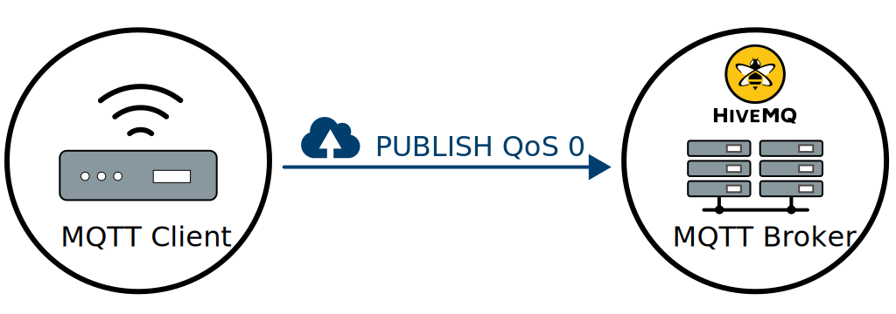
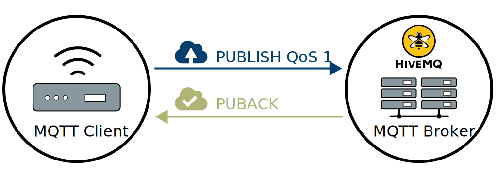
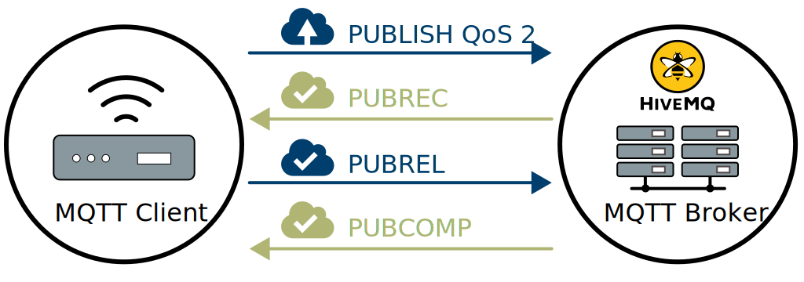

# MQTT QoS

[TOC]

## QoS 等级

`MQTT` 中存在3个等级的 `QoS`：

- `QoS level 0`
- `QoS level 1`
- `QoS level 2`

### QoS level 0

至多一次，at most once



### QoS level 1

至少一次，at least once

`Broker` 一接收到消息就会向 `publisher` 发送一个叫作 `PUBACK` 消息的响应。



### Qos level 2

只有一次，exactly once



## QoS 等级对照表

`MQTT` 发布与订阅操作中的 `QoS` 代表了不同的含义：

- 发布时的 `QoS` 表示消息发送到服务端时使用的 `QoS`
- 订阅时的 `QoS` 表示服务端向自己转发消息时可以使用的最大 `QoS`

| 发布消息的 QoS | 主题订阅的 QoS | 接收消息的 QoS |
| -------------- | -------------- | -------------- |
| 0              | 0              | 0              |
| 0              | 1              | 0              |
| 0              | 2              | 0              |
| 1              | 0              | 0              |
| 1              | 1              | 1              |
| 1              | 2              | 1              |
| 2              | 0              | 0              |
| 2              | 1              | 1              |
| 2              | 2              | 2              |

由上图可知

```python
接收消息的 QoS = MIN(发布消息的 QoS, 主题订阅的 QoS)
```

