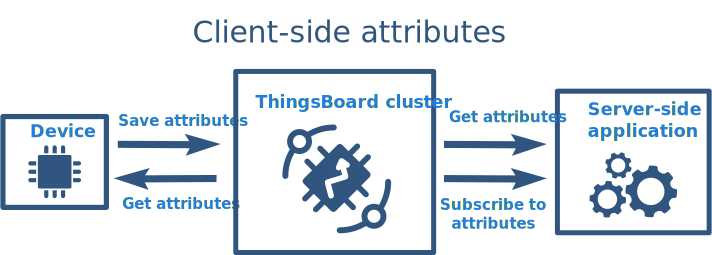

# ThingsBoard 属性

> 参见：[Working with IoT device attributes | ThingsBoard Community Edition](https://thingsboard.io/docs/user-guide/attributes/)

属性存储在数据库中。

属性被视为键值对。键是字符串，基本上也就是属性的名字；属性值可以是字符串型、布尔型、浮点型、整型或 `JSON`。例如：

```json
{
    "firmwareVersion": "v2.3.1",
    "booleanParameter": true,
    "doubleParameter": 42,
    "longParameter": 73,
    "configuration": {
        "someNumber": 42,
        "someArray": [1, 2, 3],
        "someNestedObject": {
            "key": "value"
        }
    }
}
```

推荐使用**驼峰大小写法**则命名属性。

## 分类

- 服务端属性
- 客户端属性
- 共享属性

### 服务端属性

设备固件无法访问服务端属性。


### 客户端属性



### 共享属性

