# ThingsBoard 调研笔记-设备连接

## 传输协议

### 内置传输协议

内置传输协议使得设备可以经由这些协议与 `ThingsBoard` 直接通信。

`ThingsBoard` 的内置协议包含：

- `MQTT`
- `CoAP`
- `HTTP`
- `LwM2M`
- `SNMP`

上述协议支持 `JSON`、`Protocol Buffers` 以及自定义的数据格式。