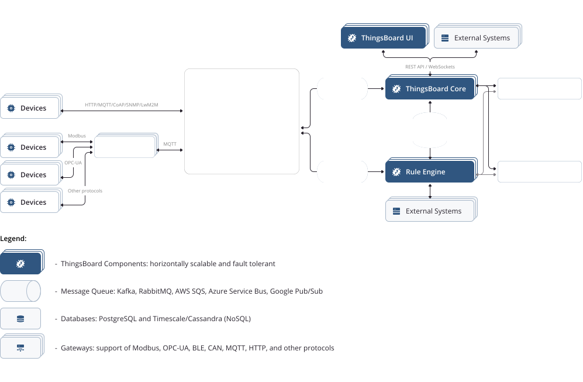

# ThingsBoard 调研记录-概况

[TOC]

## 概述

`ThingsBoard` 是一个开源物联网平台，可以快速开发、管理和扩展物联网项目。

`ThingsBoard` 具有以下功能：

- 提供设备、资产和客户，并定义它们之间的关系。
- 从设备和资产收集并可视化数据。
- 通过复杂的事件处理分析传入的遥测和触发警报。
- 使用远程过程调用（RPC）控制设备。
- 基于设备生命周期事件、REST API事件、RPC请求等构建工作流。
- 设计动态且响应迅速的仪表板，并向客户展示设备或资产遥测和见解。
- 使用可自定义的规则链启用特定于用例的功能。
- 将设备数据推送到其他系统。

## 架构

### 架构图

### 概念

- `Device`：设备
- `Gateway`：网关
- `Rule Engine`：规则引擎
- `Message Queue`：消息队列；如：`Kafka`、`RabbitMQ` 等
- `Database`：数据库；支持关系型数据库 `PostgreSQL` 以及非关系型数据库 `Timescale` 或 `Cassandra` 

## 设计目标

- 扩展性：水平扩展平台。
- 容错性：无单点失效故障。
- 健壮性和稳健性：单个服务器节点可以处理数十个甚至数十万个设备；集群可以处理数百万个设备。
- 可定制性：通过可定制的组件（`widget`）和规则引擎（`rule engine`）节点，可以轻松添加新功能。
- 耐用性：永不丢失数据。