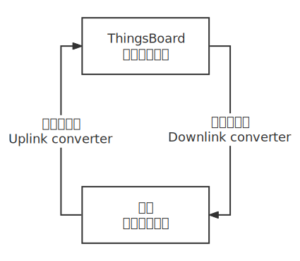

# ThingsBoard 调研记录-网关

[TOC]

`Thingsboard` 物联网网关是一个开源解决方案，允许您将连接到传统和第三方系统的设备与 `Thingsboard` 集成。

## 架构

物联网网关的主要作用：

* 连接感知层与网络层设备
* 同层或不同层之间协议转换
* 提供设备管理能力
* 增强接入能力，丰富接入方式
* 提供计算、边缘计算能力

## 网关架构

### Connector 连接器

该组件的用途是连接到外部系统（如 `MQTT` 代理或 `OPC-UA` 服务器）或直接连接到设备（如 `Modbus`、`BLE` 或 `CAN`）。

一旦连接，连接器要么轮询来自这些系统的数据，要么订阅更新。轮询与订阅取决于协议功能。例如，我们使用 `MQTT` 连接器的订阅模型，以及 `Modbus` 和 `CAN` 的轮询。

连接器还能够直接或通过外部系统将更新推送到设备。

### Converter 转换器

转换器负责将数据从协议特定格式转换为 `ThingsBoard` 格式。

**转换器**由**连接器**调用。转换器通常特定于连接器支持的协议。例如：对 `MQTT Connector` 使用订阅模式、对 `Modbus` 使用轮训模式

有**上行转换器**和**下行转换器**：

* 上行转换器用于将数据从特定协议转换为ThingsBoard格式。
* 下行转换器用于将来自 `ThingsBoard` 的消息转换为特定的协议格式。

### Event Storage 事件存储

事件存储用于临时存储由连接器产生的遥测和其他事件，直到它们被交付到 `ThingsBoard`。

事件存储支持两种实现：**内存队列**和**持久文件存储**。这两种实现都确保在网络中断的情况下最终交付设备数据。

* 内存队列最小化IO操作，但在网关进程重新启动的情况下可能会丢失消息。

* 持久文件存储在进程重新启动后仍然有效，但会对文件系统执行IO操作。

### ThingsBoard Client ThingsBoard 客户端

网关通过MQTT协议与ThingsBoard通信，并使用此处描述的API。

ThingsBoard Client是一个单独的线程，它轮询事件存储并在与ThingsBoard的连接处于活动状态时传递消息。

ThingsBoard客户端支持连接监控、批量事件以提高性能和许多其他功能。

### Gateway Service 网关服务

网关服务负责连接器、事件存储和 `ThingsBoard` 客户端的引导。

该服务收集并定期向ThingsBoard报告有关传入消息和连接设备的统计信息。

网关服务保留已连接设备的列表，以便在网关重新启动时能够重新订阅设备配置更新。

## Connector 连接器

### REST connector / REST 连接器

> 参考：[REST Connector](https://thingsboard.io/docs/iot-gateway/config/rest/)

用于创建终端节点以及通过传入的 `HTTP` 请求手机数据

## 硬件实例

以映翰通5G边缘计算网关 InGateway974 为例。参考：[InGateway974| 5G边缘计算网关](https://www.inhand.com.cn/products/edge-computing-gateway-974.html)

