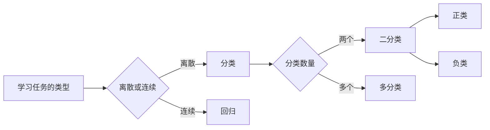

# 《机器学习》读书笔记

## 第1章  绪论

[TOC]

### 学习任务的类型

### 术语概念

|     中文 | 英文              |
| -------: | ----------------- |
|   数据集 | `data set`        |
|     示例 | `instance`        |
|     样本 | `sample`          |
|     属性 | `attribute`       |
|     特征 | `feature`         |
|   属性值 | `attribute value` |
| 属性空间 | `attribute space` |
| 样本空间 | `sample space`    |
| 特征向量 | `feature vector`  |
|     维数 | `dimensionality`  |
|   训练集 | `training set`    |
|   测试集 | `testing set`     |
|   错误率 | `error rate`      |
|     精度 | `accuracy`        |

# 机器学习 第9章 聚类

[TOC]

