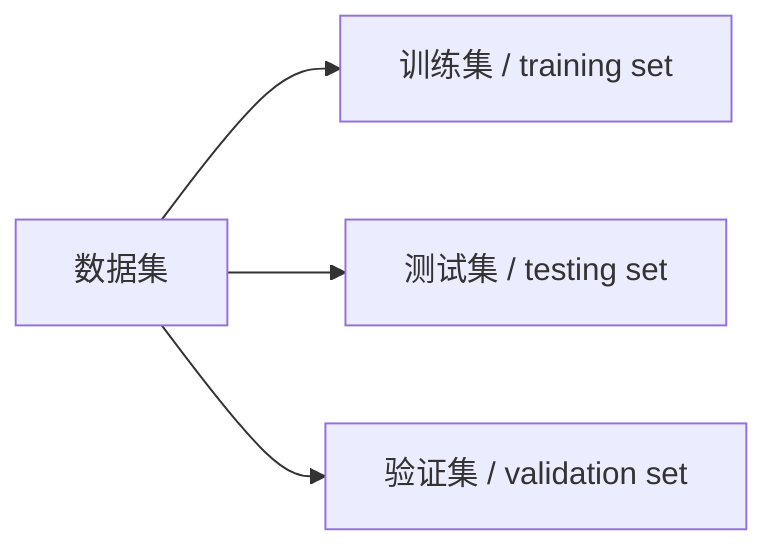

# 《机器学习》读书笔记 第2章 模型评估与选择

[TOC]

### 错误率（`error rate`）

$$
E = \frac{a}{m}
$$

意为：在 $m$ 个样本中，有 $a$ 个样本分类错误

### 精度（`accuracy`）

$$
1 - E = 1 - \frac{a}{m}
$$

### 误差（`error`）

学习器的实际预测输出 与 样本的真实输出之间的差异

### 泛化误差（`generalization error`）

学习器在新样本上产生的误差

### 过拟合（`overfitting`）

无法彻底避免，只能缓解或减小其风险

### 欠拟合（`underfitting`）

与过拟合相对

### 测试误差（`testing error`）

## 数据集的划分

### 划分类型

#### 训练集（`training set`）

#### 测试集（`testing set`）

用于测试学习器对新样本的判别能力

##### 测试误差（`testing error`）

在测试集上得出的误差，可作为泛化误差的近似

##### 训练误差（`training error`）

亦称：**经验误差**（`empirical error`）

学习器在训练集上产生的误差

#### 验证集（`verify set`）

### 划分方法

#### 留出法（`hold-out`）

#### 交叉验证法（`cross validation`）

又称 **k 折交叉验证**（`k-fold cross validation`）

先将数据集 $D$ 划分为 $k$ 个大小相似的互斥子集， 即
$$
D = D_{1} \cup D_{2} \cup \ ... \  \cup D_{k}
$$
其中
$$
D_{i} \cap D_{i}=\varnothing, \quad (i \neq j)
$$
每个子集 $D_{i}$ 都 尽可 能保持数据分布的一致性，即从 $D$ 中通过分层采样得到。然后，每次用 $k-1$ 个子集的并集作为训练集，余下的那个子集作为测试集。

#### 自助法（`bootstrapping`）

