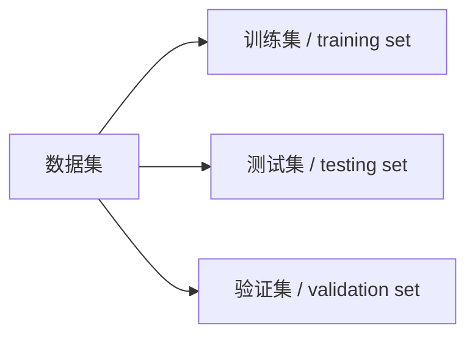
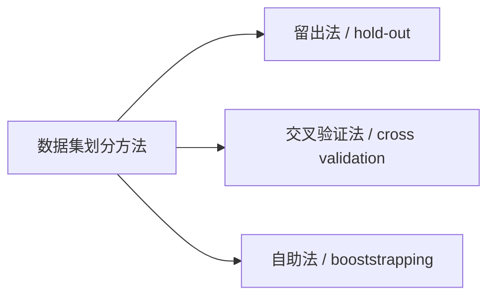

# 《机器学习》读书笔记 第2章 模型评估与选择

[TOC]

### 错误率（`error rate`）

$$
E = \frac{a}{m}
$$

意为：在 $m$ 个样本中，有 $a$ 个样本分类错误

### 精度（`accuracy`）

$$
1 - E = 1 - \frac{a}{m}
$$

### 误差（`error`）

学习器的实际预测输出 与 样本的真实输出之间的差异

### 泛化误差（`generalization error`）

学习器在新样本上产生的误差

### 过拟合（`overfitting`）

无法彻底避免，只能缓解或减小其风险

### 欠拟合（`underfitting`）

与过拟合相对

### 测试误差（`testing error`）

## 数据集的划分

### 划分类型

#### 训练集（`training set`）

#### 测试集（`testing set`）

用于测试学习器对新样本的判别能力

##### 测试误差（`testing error`）

在测试集上得出的误差，可作为泛化误差的近似

##### 训练误差（`training error`）

亦称：**经验误差**（`empirical error`）

学习器在训练集上产生的误差

#### 验证集（`verify set`）

### 划分方法

#### 留出法（`hold-out`）

该方法直接将数据集 $D$ 划分为两个互斥的集合，其中一个 集合作为训练集 $S$，另一个作为测试集 $T$， 即 $ D = B \cup T, S \cap T= \varnothing $.在 $S$ 上训 练出模型后，用 $T$ 来评估其测试误差。

#### 交叉验证法（`cross validation`）

又称 **k 折交叉验证**（`k-fold cross validation`）

先将数据集 $D$ 划分为 $k$ 个大小相似的互斥子集， 即
$$
D = D_{1} \cup D_{2} \cup \ ... \  \cup D_{k}
$$
其中
$$
D_{i} \cap D_{i}=\varnothing, \quad (i \neq j)
$$
每个子集 $D_{i}$ 都 尽可 能保持数据分布的一致性，即从 $D$ 中通过分层采样得到。然后，每次用 $k-1$ 个子集的并集作为训练集，余下的那个子集作为测试集。

#### 自助法（`bootstrapping`）

给定包含 $m$ 个样本的数据集 $D$ ， 我们对它进行采样产生数据集 $D'$：每次随机从 $D$ 中挑选一个 样本 ，将其拷贝放入 $D'$ ，然后再将该样本放回初始数据集 $D$ 中，使得该样本在 下次采样时仍有可能被采到；这个过程重复执行 m 次后，我们就得到了包含 $m$ 个样本的数据集 $D'$。$D'$ 用过训练集，$D / D'$ 用作测试集

## 性能度量

### 均方误差（`mean square error`）

对于样例集 $D$，有
$$
E(f ; D)=\frac{1}{m} \sum_{i=1}^{m}\left(f\left(\boldsymbol{x}_{i}\right)-y_{i}\right)^{2}
$$
更一般的可描述为
$$
E(f ; \mathcal{D})=\int_{\boldsymbol{x} \sim \mathcal{D}}(f(\boldsymbol{x})-y)^{2} p(\boldsymbol{x}) \mathrm{d} \boldsymbol{x}
$$

### 错误率（`error rate`）

$$
E(f ; D)=\frac{1}{m} \sum_{i=1}^{m} \mathbb{I}\left(f\left(\boldsymbol{x}_{i}\right) \neq y_{i}\right)
$$

更一般的有
$$
E(f ; \mathcal{D})=\int_{\boldsymbol{x} \sim \mathcal{D}} \mathbb{I}(f(\boldsymbol{x}) \neq y) p(\boldsymbol{x}) \mathrm{d} \boldsymbol{x}
$$

### 精度（`accuracy`）

$$
\begin{aligned}
\operatorname{acc}(f ; D) &=\frac{1}{m} \sum_{i=1}^{m} \mathbb{I}\left(f\left(\boldsymbol{x}_{i}\right)=y_{i}\right) \\
&=1-E(f ; D)
\end{aligned}
$$

更一般的有
$$
\begin{aligned}
\operatorname{acc}(f ; \mathcal{D}) &=\int_{\boldsymbol{x} \sim \mathcal{D}} \mathbb{I}(f(\boldsymbol{x})=y) p(\boldsymbol{x}) \mathrm{d} \boldsymbol{x} \\
&=1-E(f ; \mathcal{D})
\end{aligned}
$$

### 查准率、查全率和 $ F_1 $

$$
\begin{array}{c|c|c}
\hline &  {\text { 预测结果 }}  & \text { 预测结果 } \\ 
\text { 真实情况 } & \text { 正例 } &  \text { 反例 } \\
\hline \text { 正例 } & T P(\text { 真正例 }) & F N(\text { 假反例 }) \\
\hline \text { 反例 } & F P(\text { 假正例 }) & T N(\text { 真反例 }) \\
\hline
\end{array}
$$

$ TP $、$ FN $、$ FP $ 和 $ TN $ 分别代表对应样例数，由此可知：$TP+FN+FP+TN $ 等于全部样例数

查准率和查全率是一对矛盾的度量。一般来说，查准率高时，查全率往往 偏低;而查全率高时，查准率往往偏低。

#### 查准率（`precision`）

$$
P=\dfrac{T P}{T P+F P}
$$

$$
\operatorname{macro}-P=\dfrac{1}{n} \sum_{i=1}^{n} P_{i}
$$

$$
\operatorname{micro}-P=\frac{\overline{T P}}{\overline{T P}+\overline{F P}}
$$

#### 查全率（`recall`）

$$
R=\dfrac{T P}{T P + F N}
$$

$$
\operatorname{macro-}R=\dfrac{1}{n} \sum_{i=1}^{n} R_{i}
$$

$$
\operatorname{micro-}R=\frac{\overline{T P}}{\overline{T P}+\overline{F N}}
$$

#### 平衡点（`Balance-Event Point`）

其值为当 $ \text{查全率} = \text{查准率} $ 时 的取值，其值越大，说明学习器的性能越好。

#### $F1$

$$
F 1=\dfrac{2 \times P \times R}{P+R}=\dfrac{2 \times T P}{\text { 样例总数 }+T P-T N}
$$

$$
\text { macro- }F 1=\dfrac{2 \times \operatorname{macro}-P \times \operatorname{macro}-R}{\operatorname{macro}-P+\operatorname{macro}-R}
$$

$$
\text { micro-} F 1=\frac{2 \times \operatorname{micro}-P \times \operatorname{micro}-R}{\operatorname{micro}-P+\operatorname{micro}-R}
$$

#### $F\beta$

$$
F_{\beta}=\dfrac{\left(1+\beta^{2}\right) \times P \times R}{\left(\beta^{2} \times P\right)+R}
$$

其中 $\beta>0$ 度量了查全率对查准率的相对重要性。

$ \beta = 1 $ 时退化为标准的 $F_1$；$\beta>1$ 时查全率有更大影响；$\beta<1$ 时查准率有更大影响。

### 真正率（`True Positive Rate`）

$$
\mathrm{TPR} = \dfrac{T P}{T P+F N}
$$

### 假正例率（`False Positive Rate`）

$$
\mathrm{FPR} =\frac{F P}{T N+F P}
$$

### ROC  和 AUC

ROC 全称是"受试者工作特征" （Receiver Operating Characteristic）曲线

AUC 的估计如下
$$
\mathrm{AUC}=\frac{1}{2} \sum_{i=1}^{m-1}\left(x_{i+1}-x_{i}\right) \cdot\left(y_{i}+y_{i+1}\right)
$$

$$
\ell_{\text {rank }}=\frac{1}{m^{+} m^{-}} \sum_{\boldsymbol{x}^{+} \in D^{+}} \sum_{\boldsymbol{x}^{-} \in D^{-}}\left(\mathbb{I}\left(f\left(\boldsymbol{x}^{+}\right)<f\left(\boldsymbol{x}^{-}\right)\right)+\frac{1}{2} \mathbb{I}\left(f\left(\boldsymbol{x}^{+}\right)=f\left(\boldsymbol{x}^{-}\right)\right)\right)
$$

$$
\mathrm{AUC} + \ell_{\text {rank }} = 1
$$

### 代价敏感错误率与代价曲线

$$
\begin{array}{c|c|c}
\hline   &  {\text { 预测类别 }} & \text { 预测类别 } \\
 \text { 真实类别 } & \text { 第 } 0 \text { 类 } & \text { 第 } 1 \text { 类 } \\
\hline \text { 第 } 0 \text { 类 } & 0 & {cost}_{01} \\
\hline \text { 第 } 1 \text { 类 } & {cost}_{10} & 0 \\
\hline
\end{array}
$$

#### 代价敏感错误率

$$
\begin{aligned}
E(f ; D ; \mathrm{cost})=& \frac{1}{m}\left(\sum_{\boldsymbol{x}_{i} \in D^{+}} \mathbb{I}\left(f\left(\boldsymbol{x}_{i}\right) \neq y_{i}\right) \times {cost}_{01}+\sum_{\boldsymbol{x}_{i} \in D^{-}} \mathbb{I}\left(f\left(\boldsymbol{x}_{i}\right) \neq y_{i}\right) \times {cost}_{10}\right)
\end{aligned}
$$

正例概率代价
$$
P(+) \cos t=\frac{p \times {cost}_{01}}{p \times {cost}_{01}+(1-p) \times {cost}_{10}}
$$
其中 $p$ 为样例为正的概率