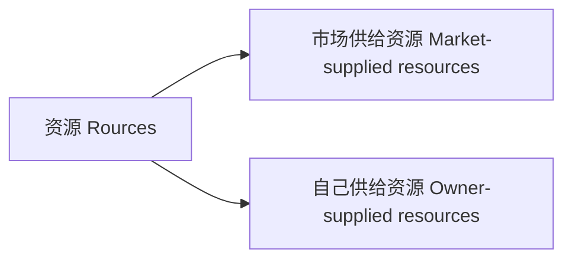
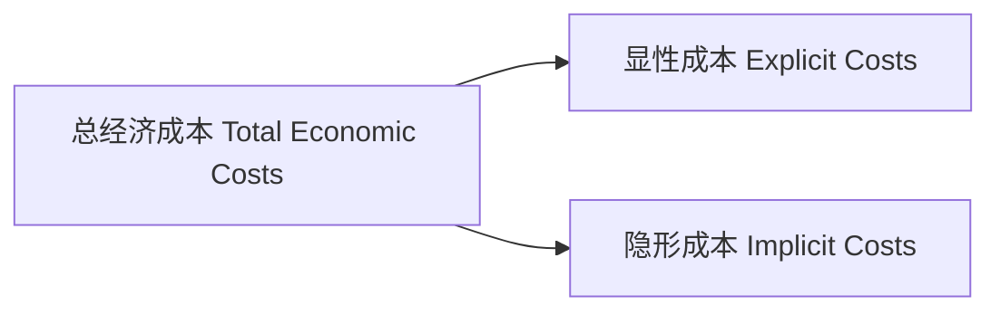
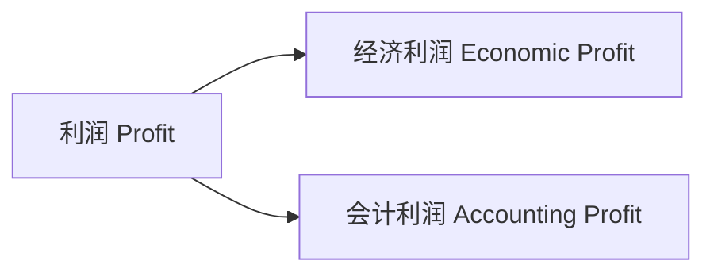

# 管理经济学

[TOC]

## 资源

### 来源

### 成本

显性成本：市场供给资源的成本

隐形成本：自己供给资源的成本
$$
\text{总经济成本 }= \text{显性成本} + \text{隐形成本}
$$

#### 隐形成本（`Implicit Costs`）

##### 例

* 自有资金
* 自有土地
* 时间

## 利润

$$
\begin{align}
\text{经济利润} &= \text{总收入} – \text{总经济成本} \\
&= \text{总收入} – \text{显性成本} – \text{隐形成本}
\end{align}
$$

$$
\begin{align}
\text{会计利润} &= \text{总收入} – \text{显性成本}
\end{align}
$$

由此可知，会计利润没有从经济利润中扣除隐形成本。

## 价格接受、制定者

### 价格接受者（`Price-Takers`）

无法制定产品价格；价格由市场上的供需力量决定

### 价格制定者（`Price-Setters`）

可以制定产品价格；有一定的市场势利：可以提升产品价格而不损失任何销量

## 市场结构（`Market Structure`）

* 完全竞争（`Perfect Competition`）

    无差异产品

* 完全垄断（`Perfect Monopoly`）

* 垄断竞争（`Monopolistic Competition`）

    差异化产品

* 寡头垄断（`Oligopoly`）

|       特征       | 完全竞争  |    垄断竞争    |          寡头垄断           |   完全垄断    |
| :--------------: | :-------: | :------------: | :-------------------------: | :-----------: |
|   **企业数量**   |   Many    |      Many      |             Few             |      One      |
|   **产品类型**   | Identical | Differentiated | Identical OR Differentiated |    Unique     |
| **进入市场难度** |   High    |      High      |             Low             | Entry Blocked |

## 商品

### 分类

#### 自身属性分类

##### 正常品（`Normal good `）

当其他因素不变时，收入与需求量**正**相关，即：

* 收入增加，需求量增加
* 收入减少，需求量减少

##### 劣等品（`Inferior good `）/ 吉芬品（`Giffen good`）

当其他因素不变时，收入与需求量**负**相关，即：

* 收入增加，需求量减少
* 收入减少，需求量增加

#### 相关品分类

### 替代品（`Substitutes`）

当其他因素不变时，一种商品价格与另一种商品的需求量正相关。即：

* 一种商品价格增加，与另一种商品的需求量增加
* 一种商品价格减少，与另一种商品的需求量减少

### 互补品（`Complements`）

当其他因素不变时，一种商品价格与另一种商品的需求量负相关。即：

* 一种商品价格增加，与另一种商品的需求量减少
* 一种商品价格减少，与另一种商品的需求量增加

## 需求（`Demand`）

符号：$ Q_d $

影响因子：

|    因子    |       符号       | 商品类型 | 关系   |
| :--------: | :--------------: | :------: | ------ |
|    价格    |      $ P $       |          | 负相关 |
|    收入    |      $ M $       |  正常品  | 正相关 |
|            |                  |  劣等品  | 负相关 |
| 相关品价格 |     $ P_R $      |  替代品  | 正相关 |
|            |                  |  互补品  | 负相关 |
|    品味    | $ \mathcal { J } $ |          | 正相关 |
|  期望价格  |     $ P_e $      |          | 正相关 |
| 消费者数量 |      $ N $       |          | 正相关 |

### 一般供需函数（`General demand function`）

$$
\begin{align}
Q_{d} &= f\left(P, M, P_{R}, \mathcal{J}, P_{e}, N\right) \\
&= {a}+{b} {P}+{c} {M}+{d} {P}_{R}+{e} \mathcal { J }+{f} {P}_{{e}}+{g} {N}
\end{align}
$$
### 直接需求函数（`Direct Demand Function`）

保持一般需求函数中除商品价格不变得到的函数
$$
\begin{align}
Q_{d} &= f\left(P\right) \\
&= {a}+{b} {P}
\end{align}
$$
直接需求函数的函数图像是一条直线，斜率为负。

#### 变化

* 当商品价格改变时，引起的是需求量的改变；
* 当除商品价格以外的其他因素改变时，引起的是需求的改变；

总结：

* 当函数涉及的自变量发生变化时，引起的变化是沿着曲线的移动
* 当函数不涉及的自变量发生变化时，引起的变化是曲线整体的移动