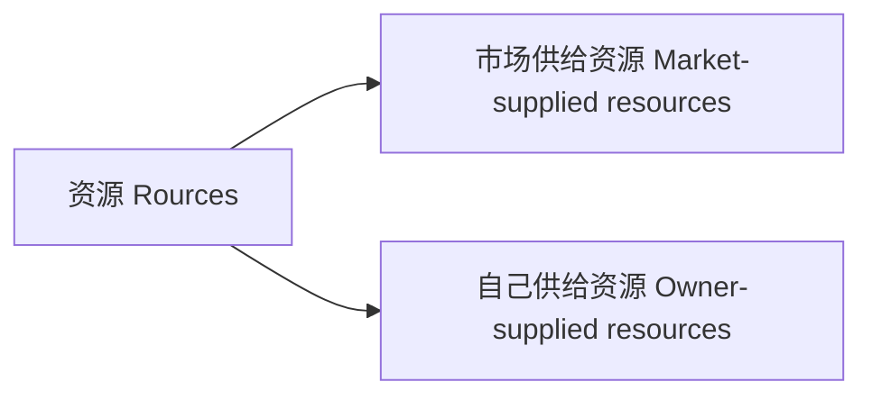
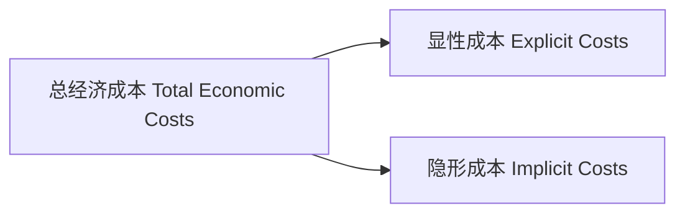
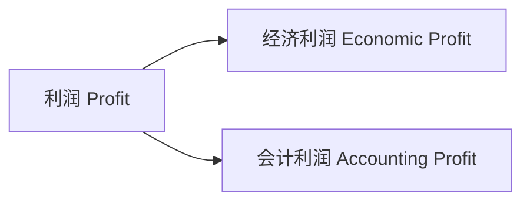

# 管理经济学

[TOC]

## 资源

### 来源

### 成本

显性成本：市场供给资源的成本

隐形成本：自己供给资源的成本
$$
\text{总经济成本 }= \text{显性成本} + \text{隐形成本}
$$

#### 隐形成本（`Implicit Costs`）

##### 例

* 自有资金
* 自有土地
* 时间

## 利润

$$
\begin{align}
\text{经济利润} &= \text{总收入} – \text{总经济成本} \\
&= \text{总收入} – \text{显性成本} – \text{隐形成本}
\end{align}
$$

$$
\begin{align}
\text{会计利润} &= \text{总收入} – \text{显性成本}
\end{align}
$$

由此可知，会计利润没有从经济利润中扣除隐形成本。

## 价格接受、制定者

### 价格接受者（`Price-Takers`）

无法制定产品价格；价格由市场上的供需力量决定

### 价格制定者（`Price-Setters`）

可以制定产品价格；有一定的市场势利：可以提升产品价格而不损失任何销量

## 市场结构（`Market Structure`）

* 完全竞争（`Perfect Competition`）

    无差异产品

* 完全垄断（`Perfect Monopoly`）

* 垄断竞争（`Monopolistic Competition`）

    差异化产品

* 寡头垄断（`Oligopoly`）

|       特征       | 完全竞争  |    垄断竞争    |          寡头垄断           |   完全垄断    |
| :--------------: | :-------: | :------------: | :-------------------------: | :-----------: |
|   **企业数量**   |   Many    |      Many      |             Few             |      One      |
|   **产品类型**   | Identical | Differentiated | Identical OR Differentiated |    Unique     |
| **进入市场难度** |   High    |      High      |             Low             | Entry Blocked |

## 商品

### 分类

#### 自身属性分类

##### 正常品（`Normal good `）

当其他因素不变时，收入与需求量**正**相关，即：

* 收入增加，需求量增加
* 收入减少，需求量减少

##### 劣等品（`Inferior good `）/ 吉芬品（`Giffen good`）

当其他因素不变时，收入与需求量**负**相关，即：

* 收入增加，需求量减少
* 收入减少，需求量增加

#### 相关品分类

### 替代品（`Substitutes`）

当其他因素不变时，一种商品价格与另一种商品的需求量正相关。即：

* 一种商品价格增加，与另一种商品的需求量增加
* 一种商品价格减少，与另一种商品的需求量减少

### 互补品（`Complements`）

当其他因素不变时，一种商品价格与另一种商品的需求量负相关。即：

* 一种商品价格增加，与另一种商品的需求量减少
* 一种商品价格减少，与另一种商品的需求量增加

## 需求（`Demand`）

符号：$ Q_d $

影响因子：

|    因子    |       符号       | 商品类型 | 关系   |
| :--------: | :--------------: | :------: | ------ |
|    价格    |      $ P $       |          | 负相关 |
|    收入    |      $ M $       |  正常品  | 正相关 |
|            |                  |  劣等品  | 负相关 |
| 相关品价格 |     $ P_R $      |  替代品  | 正相关 |
|            |                  |  互补品  | 负相关 |
|    品味    | $ \mathcal { J } $ |          | 正相关 |
|  期望价格  |     $ P_e $      |          | 正相关 |
| 消费者数量 |      $ N $       |          | 正相关 |

### 一般供需函数（`General demand function`）

$$
\begin{align}
Q_{d} &= f\left(P, M, P_{R}, \mathcal{J}, P_{e}, N\right) \\
&= {a}+{b} {P}+{c} {M}+{d} {P}_{R}+{e} \mathcal { J }+{f} {P}_{{e}}+{g} {N}
\end{align}
$$
### 直接需求函数（`Direct Demand Function`）

保持一般需求函数中除商品价格不变得到的函数
$$
\begin{align}
Q_{d} &= f\left(P\right) \\
&= {a}+{b} {P}
\end{align}
$$
直接需求函数的函数图像是一条直线，对于正常品，其斜率为负。

#### 变化

* 当商品价格改变时，引起的是需求量的改变；
* 当除商品价格以外的其他因素改变时，引起的是需求的改变；

总结：

* 当函数涉及的自变量发生变化时，引起的变化是沿着曲线的移动
* 当函数不涉及的自变量发生变化时，引起的变化是曲线整体的移动

## 供给（`Supply`）

符号：$ Q_s $

因素：

|    因素    |   符号    | 商品类型 | 关系   |
| :--------: | :-------: | :------: | ------ |
|    价格    |   $ P $   |          | 正相关 |
|  要素价格  | $ P_{I} $ |          | 负相关 |
| 相关品价格 |  $ P_R $  |  替代品  | 负相关 |
|            |           |  互补品  | 正相关 |
|    技术    |   $ T $   |          | 负相关 |
|  期望价格  |  $ P_E $  |          | 负相关 |
|  厂商数量  |   $ F $   |          | 正相关 |

### 一般供给函数（`General supply function`）

$$
\begin{align}
Q_{s} &= f\left(P, P_{P}, P_{r}, T, P_{e}, F\right) \\
&=h+k P+l P_{I}+m P_{R}+n T+r P_{E}+s F
\end{align}
$$

### 直接供给函数（`Direct Supply Function`）

$$
\begin{align}
Q_{s} &= f\left(P\right) \\
&=h+k P
\end{align}
$$

直接供给函数的函数图像是一条直线，对于正常品，其斜率为正。

#### 变化

* 当商品价格改变时，引起的是供给量的改变；
* 当除商品价格以外的其他因素改变时，引起的是供给的改变；

总结：

* 当函数涉及的自变量发生变化时，引起的变化是沿着曲线的移动
* 当函数不涉及的自变量发生变化时，引起的变化是曲线整体的移动

## 市场均衡（`Market Equilibrium`）

当供给量与需求量相等时，市场达到均衡，此时有：$ Q_d = Q_s $，此时的商品价格称为 **市场出清价格** 或 **均衡价格**

| 市场状态 |  函数表达式   |
| :------: | :-----------: |
|   过剩   | $ Q_s > Q_d $ |
|   均衡   | $ Q_s = Q_d $ |
|   短缺   | $ Q_s < Q_d $ |

## 价格控制

### 最高价格（`Ceiling price`）控制

当均衡价格高于最高价格，导致短缺

### 最低价格（`Floor price`）控制

当均衡价格低于最低价格，导致过剩

## 最优化（Optimization）

### 三要素

* 目标（`Objective`）
* 变量（`Variable`）
* 约束（`Constraint`）

### 问题类型

* 最大化问题（`Maximization Problem`）
* 最优化问题（`Minimization Problem`）

## 优化类型

* 无约束最优化（`Unconstrained optimization`）

* 有约束最优化（`Constrained optimization`）

    需考虑投入要素价格。可借助边际效用价格比来衡量

## 变量类型

* 离散变量
* 连续变量

## 总收入（`Total Revenue`，`TR`）

## 总成本（`Total Cost`，`TC`）

## 净利润（`Net Benefit`，`NB`）

$$
\begin{align}
\text{Net Benefit} &= \text{Total Revenue} - \text{Total Cost} \\
\text{净利润} &= \text{总收入} - \text{总成本}
\end{align}
$$

## 边际分析（Marginal Analysis）

### 边际收益（`Marginal Benefit`，`MB`）

$$
\begin{array}{l}
M B=\dfrac{\text { Change in total benefit }}{\text { Change in activity }}=\dfrac{\Delta T B}{\Delta A} \\
\end{array}
$$

### 边际成本（`Marginal Cost`，`MC`）

$$
\begin{array}{l}
M C=\dfrac{\text { Change in total benefit }}{\text { Change in activity }}=\dfrac{\Delta T C}{\Delta A}
\end{array}
$$

### 结论

* 如果边际收益 $>$ 边际成本，应该增加投入
* 如果边际收益 $>$ 边际成本，应该减少投入
* 如果边际收益 $=$ 边际成本，达到最优化水平

## 边际效用价格比（MB/P）

$$
\dfrac{\text{Margnal Benefit}}{\text{Price}}
$$

在有约束最优化问题中，在最优点处，必有

$$
\dfrac{{MB}_{A}}{P_{A}} = \dfrac{{MB}_{B}}{P_{B}} = \cdots = \dfrac{{MB}_{Z}}{P_{Z}}
$$

若有

$$
\dfrac{{MB}_{A}}{P_{A}} > \dfrac{{MB}_{B}}{P_{B}}
$$

则应加大对要素 $A$ 的投入，减少或保持要素 $B$ 的投入，直至二者相等

## 成本（Cost）

* 沉默成本（sunk cost）
* 固定成本（fixed costs）
* 平均成本（average costs）

## 消费者优化问题（The Consumer’s Optimization Problem）

## 消费者理论（Consumer Theory）

## 消费约束（Consumption Bundles）

## 效用（Utility）

消费者从商品或服务中获得的满意度；

是主观的

消费者的目标是其效用最大化
$$
U = f(X, Y)
$$

### 边际效用（Marginal Utility）

$$
MU = \dfrac{\Delta U}{\Delta X} = \lim_{\Delta Q \rightarrow 0} \dfrac{\Delta T U\left(Q\right)}{\Delta Q}
$$

其描述的是：

* 当消费者增加一个单位的某种商品或服务的消费总效用的增加量
* 当消费者减少一个单位的某种商品或服务的消费总效用的减少量

## 边际效用递减律（Law of Deminishing Marginal Utility）

## 无差异曲线（Indifference Curves）

线上的每一点代表不同的消费组合，这些消费组合给消费者带来的效用是一样的。

## 边际替代率（Marginal Rate of Substitution，MRS）

消费者在保持自己效用水平不变的情况下，为得到每一单位的 $X$，而必须放弃的 $Y$ 的数量
$$
M R S=-\dfrac{\Delta Y}{\Delta X}=\dfrac{M U_{X}}{M U_{Y}}
$$
其在无差异曲线某处的值，是该点处斜率的负数，

## 消费者预算曲线（Customer's Budget Constraint）

设 $M$ 为用户收入，商品或服务 $X$ 的价格为 $P_X$，购买量为 $X$，商品或服务 $Y$ 的价格为 $P_Y$，购买量为 $ Y $
$$
{M} = {P}_{X} {X}+{P}_{Y} {Y}
$$
由此可得
$$
Y = \dfrac{M}{P_{Y}}-\dfrac{P_{X}}{P_{Y}} X
$$
由此可绘制消费者预算约束线，这是一条斜率为负数直线

变动：

* 若消费者收入增加，则约束线向外平移；若消费者收入减少，则约束线向内平移
* 若商品或服务价格变化，则约束线旋转

## 效用最大化（Utility Maximization）

这是消费者的目标

在消费者达到效用最大化时，无差异曲线与预算约束线相切。此时有
$$
MRS = \dfrac{P_{X}}{P_{Y}} = -\dfrac{\Delta Y}{\Delta X} = \dfrac{M U_{X}}{M U_{Y}}
$$
可得
$$
\dfrac{MU_X}{P_X} = \dfrac{MU_Y}{P_Y} 
$$
扩展可得
$$
-\dfrac{\Delta X_{i}}{\Delta X_{j}}=M R S=\dfrac{P_{j}}{P_{i}}
$$

$$
\dfrac{M U_{1}}{P_{1}} = \dfrac{M U_{2}}{P_{2}} = \dfrac{M U_{3}}{P_{3}} = \ldots=\dfrac{M U_{N}}{P_{N}}
$$

## 弹性（Elasticity）

### 需求的价格弹性（Price Elasticity of Demand）

$$
E_d = \dfrac{{\Delta Q}/Q}{{\% \Delta P}/P}
$$

衡量对价格变化的敏感程度：价格变化一个百分比，交易量变化的百分比

对于正常品，$ E_d $ 为负数

|   弹性   |               表达式                | $|E|$     |
| :------: | :---------------------------------: | --------- |
|  有弹性  | $|{\% \Delta Q}| > |{\% \Delta P}|$ | $|E| > 1$ |
| 标准弹性 | $|{\% \Delta Q}| = |{\% \Delta P}|$ | $|E| = 1$ |
|  无弹性  | $|{\% \Delta Q}| < |{\% \Delta P}|$ | $|E|<1$   |

### 影响因素

* 替代品
* 占预算比重
* 调整时间

### 分类

* 点弹性

* 弧弹性

    计算公式
    $$
    {E}=\frac{\Delta {Q} / \text { Average } {Q}}{\Delta {P} / \text { Average } {P}}
    $$

### 对收入的影响

记总收入为：$ TR = P \times Q $

|          |  有弹性   | 单位弹性  |  无弹性   |
| :------: | :-------: | :-------: | :-------: |
| 价格上升 | 总收入 下降 | 总收入 不变 | 总收入 上升 |
| 价格下降 | 总收入 上升 | 总收入 不变 | 总收入 下降 |

### 对税收的影响

* 当需求比供给更有弹性时，即供给相对更缺乏弹性，税收主要由卖方承担。
* 当供给比需求更有弹性时，即需求相对更缺乏弹性，税收主要由买方承担。

总结：税收主要由相对更缺乏弹性的一方承担。

## 生产理论

### 输入

* 劳动
* 资本
* 土地
* 企业家才能

#### 类型

* 可变投入（Variable input）

    随产量变化

* 固定投入（Fixed input）

    不随产量变化，没有生产也要投入

* 准固定投入（Quasi-fixed input）

    产量为零不投入，产量只要大于零，必须整块投入。

### 生产函数（Production Function）

在给定投入的情况下，可以获得的最大产出

#### 短期生产函数

$$
Q = f(L, \overline{K}) = f(L)
$$

其中，$L$ 为劳动，$K$ 为资本

#### 平均产量（Average Product）

$$
AP = \dfrac{Q}{L}
$$

#### 边际产量（Marginal Product）

$$
MP = \dfrac{\Delta Q}{\Delta L}
$$

当 $AP$ 上升时，$MP > AP$

当 $AP$ 下降时，$MP < AP$

当 $AP$ 达到最大时，$MP = AP$

### 变动比例生产（Variable proportions production）

### 固定比例生产（Fixed proportions production）

### 技术有效（Technical efficiency）

在现行技术水平下，对于给定要素投入组合，实现产量最大化

### 经济有效（Economic efficiency）

在给定产量的情况下，总成本最低的生产

### 时间水平

#### 短期（short run）

至少有一种不变的固定投入

#### 长期（long run）

所有投入都可变

### 成本

#### 类型

##### 是否沉默

* 沉默成本（Sunk Costs）
* 可避免成本（Avoidable Costs）

##### 是否固定成本

* 总固定成本（Total fixed cost，TFC）
* 总可变成本（Total variable cost，TVC）
* 总成本（Total Cost，TC）

$$
\text{TC} = \text{TFC} + \text{TVC}
$$

* 平均固定成本（Average Fixed Cost，AFC）
    $$
    \text{AFC} = \dfrac{\text{TFC}}{\text{Q}}
    $$

* 平均可变成本（Average Variable Cost，AVC）
    $$
    \text{AVC} = \dfrac{\text{TVC}}{\text{Q}}
    $$

* 平均总成本（Average Total Cost，ATC）
    $$
    \text{ATC} = \dfrac{\text{TC}}{\text{Q}} = \text{AFC} + \text{AVC}
    $$

* 短期边际成本（Short run Marginal Cost，SMC）
    $$
    \text{SMC} = \dfrac{\Delta TVC}{\Delta Q} = \dfrac{\Delta TC}{\Delta Q}
    $$
    

## 边际产量递减原则（Law of Diminishing Marginal Product）