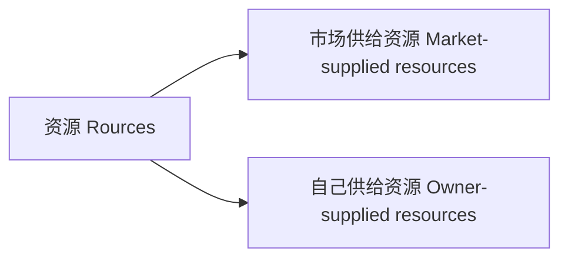
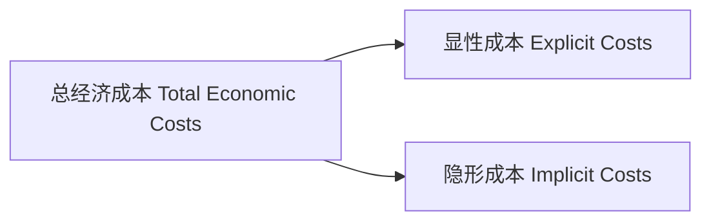
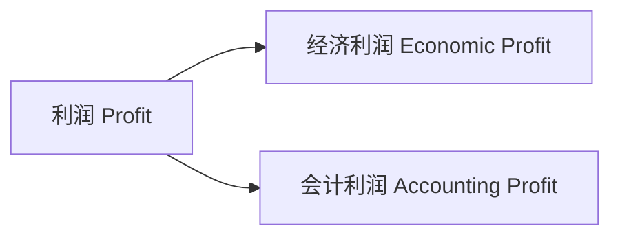

# 管理经济学

[TOC]

## 资源

### 来源

### 成本

显性成本：市场供给资源的成本

隐形成本：自己供给资源的成本
$$
\text{总经济成本 }= \text{显性成本} + \text{隐形成本}
$$

#### 隐形成本（`Implicit Costs`）

##### 例

* 自有资金
* 自有土地
* 时间

## 利润

$$
\begin{align}
\text{经济利润} &= \text{总收入} – \text{总经济成本} \\
&= \text{总收入} – \text{显性成本} – \text{隐形成本}
\end{align}
$$

$$
\begin{align}
\text{会计利润} &= \text{总收入} – \text{显性成本}
\end{align}
$$

由此可知，会计利润没有从经济利润中扣除隐形成本。

## 价格接受、制定者

### 价格接受者（`Price-Takers`）

无法制定产品价格；价格由市场上的供需力量决定

### 价格制定者（`Price-Setters`）

可以制定产品价格；有一定的市场势利：可以提升产品价格而不损失任何销量

## 市场结构（`Market Structure`）

* 完全竞争（`Perfect Competition`）

    无差异产品

* 完全垄断（`Perfect Monopoly`）

* 垄断竞争（`Monopolistic Competition`）

    差异化产品

* 寡头垄断（`Oligopoly`）

|       特征       | 完全竞争  |    垄断竞争    |          寡头垄断           |   完全垄断    |
| :--------------: | :-------: | :------------: | :-------------------------: | :-----------: |
|   **企业数量**   |   Many    |      Many      |             Few             |      One      |
|   **产品类型**   | Identical | Differentiated | Identical OR Differentiated |    Unique     |
| **进入市场难度** |   High    |      High      |             Low             | Entry Blocked |

